  

  
  
  
  

## ⚡ Lo que construyo

## 🧰 Stack

  

  
  
  
  
  

## 📈 Actividad

  <picture>
    <source media="(prefers-color-scheme: dark)" srcset="https://streak-stats.demolab.com?user=jtovar96&locale=es&theme=dark&background=1B1830&hide_border=true&ring=6C4BF5&fire=F1552B&currStreakNum=F4F4F7&sideNums=F4F4F7&currStreakLabel=F1552B&sideLabels=9D86FF&dates=9D86FF">
    
  </picture>

  <picture>
    <source media="(prefers-color-scheme: dark)" srcset="https://raw.githubusercontent.com/jtovar96/jtovar96/output/snake-dark.svg">
    
  </picture>

## 📫 Hablemos

  
  

Hecho con código, café y demasiadas bases de datos de prueba ☕

